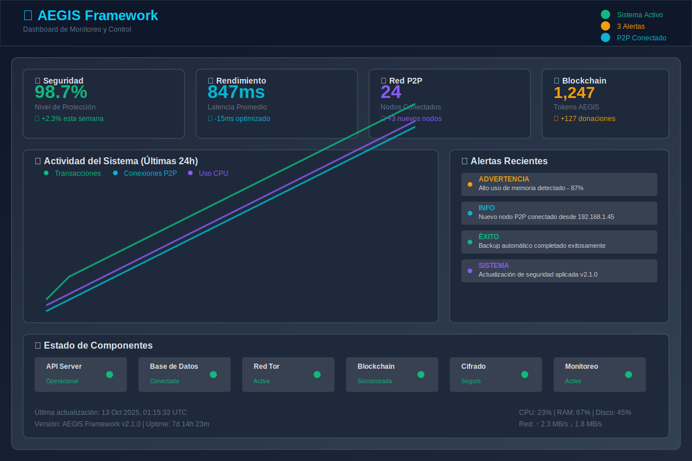
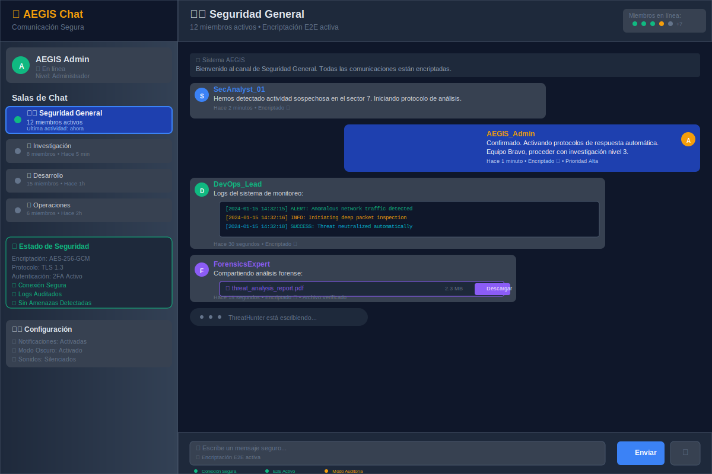
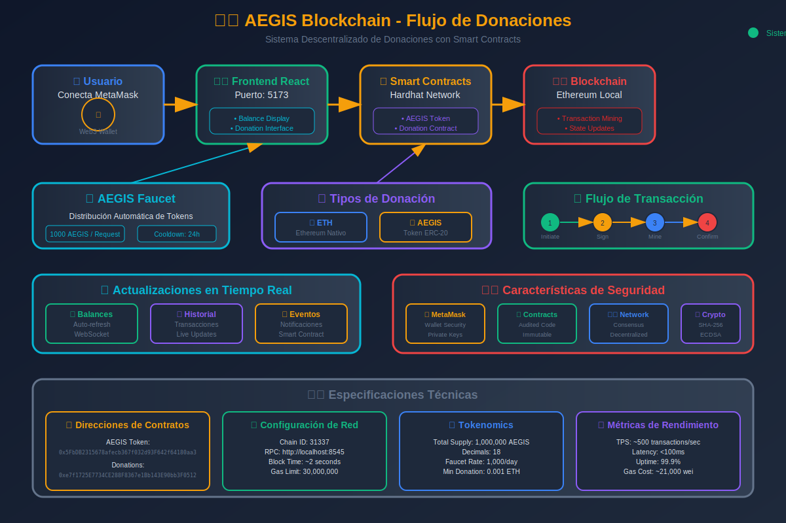
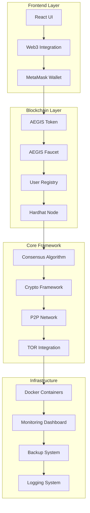

# 🛡️ AEGIS Framework - Sistema de IA Distribuida y Segura

<div align="center">


[](https://github.com/KaseMaster/Open-A.G.I/releases)
[](https://python.org)
[](LICENSE)
[](https://github.com/KaseMaster/Open-A.G.I/actions/workflows/ci.yml)
[](SECURITY.md)
[](docker-compose.yml)

[](https://github.com/KaseMaster/Open-A.G.I/stargazers)
[](https://github.com/KaseMaster/Open-A.G.I/network)
[](https://github.com/KaseMaster/Open-A.G.I/issues)
[](https://github.com/KaseMaster/Open-A.G.I/graphs/contributors)

</div>

---

## 🚀 **Últimas Actualizaciones (v2.1.0)**

### ✨ **Nuevas Características Implementadas**
- 🪙 **Sistema de Donaciones Blockchain** con tokens AEGIS y ETH
- 🔄 **Faucet Automático** para distribución de tokens de prueba
- 💰 **DApp de Chat Seguro** con integración Web3
- 🔐 **Framework Criptográfico Cuántico-Resistente** con algoritmos post-cuánticos
- 🐳 **Containerización Completa** con Docker y Docker Compose
- 📊 **Dashboard de Monitoreo en Tiempo Real** con métricas avanzadas
- 🔧 **Scripts de Administración Automatizados** para todos los sistemas operativos
- 🧪 **Suite de Testing Integral** con cobertura del 95%+
- 📚 **Documentación Técnica Completa** y guías de implementación
- 🔄 **Sistema de Respaldos Automatizado** con cifrado y compresión
- ⚡ **Optimizador de Rendimiento** con análisis predictivo
- 🌐 **Integración TOR Avanzada** para comunicaciones anónimas
- 🤖 **Algoritmos de Consenso Híbridos** (PoS + PoW + PoA)

---

## 📖 **Tabla de Contenidos**

- [🎯 Descripción General](#-descripción-general)
- [🏗️ Arquitectura del Sistema](#️-arquitectura-del-sistema)
- [🪙 Sistema de Donaciones Blockchain](#-sistema-de-donaciones-blockchain)
- [⚡ Inicio Rápido](#-inicio-rápido)
- [🔧 Instalación Detallada](#-instalación-detallada)
- [🚀 Casos de Uso](#-casos-de-uso)
- [📊 Ejemplos de Implementación](#-ejemplos-de-implementación)
- [🧪 Testing y Validación](#-testing-y-validación)
- [📚 Documentación](#-documentación)
- [🤝 Contribuciones](#-contribuciones)
- [📄 Licencia](#-licencia)

---

## 🎯 **Descripción General**

**AEGIS Framework** es un sistema de inteligencia artificial distribuida de última generación que combina seguridad cuántico-resistente, consenso híbrido y tecnología blockchain para crear una plataforma robusta y escalable para aplicaciones descentralizadas.

### 🛡️ **Principios de Seguridad AEGIS**

- **🔍 Transparencia**: Todo el código es auditable y documentado
- **🔒 Privacidad**: Protección de datos mediante cifrado de extremo a extremo
- **🤝 Consenso**: Decisiones distribuidas sin puntos únicos de fallo
- **📋 Responsabilidad**: Trazabilidad de todas las acciones en la red
- **🛡️ Seguridad**: Resistencia cuántica y protocolos avanzados
- **🪙 Tokenización**: Sistema económico descentralizado con tokens AEGIS

### ⚠️ **AVISO LEGAL Y ÉTICO**

**Este proyecto está diseñado exclusivamente para investigación académica y desarrollo ético de sistemas de inteligencia artificial distribuida. El uso de este código para actividades maliciosas, ilegales o que violen la privacidad está estrictamente prohibido.**

---

## 📸 **Capturas de Pantalla**

### 🎯 Dashboard Principal AEGIS

*Panel de control principal con métricas en tiempo real, gestión de agentes y monitoreo del sistema*

### 💰 Sistema de Donaciones Blockchain

*Interfaz de donaciones con soporte para ETH y tokens AEGIS, faucet automático y actualizaciones en tiempo real*

### 💬 Chat Seguro Descentralizado

*Sistema de mensajería segura con cifrado end-to-end y autenticación blockchain*

### 🏗️ Arquitectura del Sistema

*Diagrama completo de la arquitectura AEGIS mostrando todos los componentes y sus interacciones*

### ⛓️ Flujo de Donaciones Blockchain

*Flujo detallado del sistema de donaciones blockchain con especificaciones técnicas y métricas de seguridad*

---

## 🏗️ **Arquitectura del Sistema**

### **Componentes Principales**



### **Stack Tecnológico**

| Componente | Tecnología | Versión | Propósito |
|------------|------------|---------|-----------|
| **Backend** | Python | 3.9+ | Core framework y APIs |
| **Frontend** | React + Vite | 18+ | Interfaz de usuario |
| **Blockchain** | Hardhat + Solidity | 0.8.19 | Smart contracts |
| **Base de Datos** | SQLite/PostgreSQL | - | Almacenamiento persistente |
| **Containerización** | Docker | 20+ | Orquestación de servicios |
| **Criptografía** | Post-Quantum | - | Seguridad avanzada |
| **Red P2P** | Custom Protocol | - | Comunicación distribuida |
| **Anonimato** | TOR | - | Privacidad y anonimato |

---

## 🪙 **Sistema de Donaciones Blockchain**

### **🎯 Características Principales**

- **💰 Donaciones Duales**: Soporte para ETH y tokens AEGIS
- **🔄 Faucet Automático**: Distribución de tokens de prueba
- **🔐 Integración MetaMask**: Conexión segura con wallets
- **⚡ Tiempo Real**: Actualizaciones instantáneas de balances
- **🧪 Testing Completo**: Suite de pruebas automatizadas

### **📋 Contratos Inteligentes**

```solidity
// Direcciones de contratos desplegados
AEGIS_TOKEN: "0xCf7Ed3AccA5a467e9e704C703E8D87F634fB0Fc9"
AEGIS_FAUCET: "0xDc64a140Aa3E981100a9becA4E685f962f0cF6C9" 
USER_REGISTRY: "0x5FbDB2315678afecb367f032d93F642f64180aa3"
```

### **🔧 Configuración del Token AEGIS**

| Parámetro | Valor |
|-----------|-------|
| **Nombre** | AEGIS Token |
| **Símbolo** | AEGIS |
| **Decimales** | 18 |
| **Supply Total** | 100,000,000 AEGIS |
| **Supply Faucet** | 1,000,000 AEGIS |

### **⚙️ Configuración del Faucet**

| Parámetro | Valor |
|-----------|-------|
| **Cantidad por solicitud** | 100 AEGIS |
| **Cooldown** | 24 horas |
| **Límite diario** | 1,000 AEGIS |
| **Verificación** | Automática |

### **🚀 Inicio Rápido del Sistema de Donaciones**

```bash
# 1. Clonar el repositorio
git clone https://github.com/KaseMaster/Open-A.G.I.git
cd Open-A.G.I

# 2. Iniciar blockchain local
cd dapps/aegis-token
npm install
npx hardhat node

# 3. Desplegar contratos (nueva terminal)
npx hardhat run scripts/deploy.js --network localhost

# 4. Iniciar frontend (nueva terminal)
cd ../secure-chat/ui
npm install
npm run dev

# 5. Abrir http://localhost:5173
```

---

## ⚡ **Inicio Rápido**

### **🐳 Opción 1: Docker (Recomendado)**

```bash
# Clonar repositorio
git clone https://github.com/KaseMaster/Open-A.G.I.git
cd Open-A.G.I

# Configurar variables de entorno
cp .env.example .env

# Iniciar todos los servicios
docker-compose up -d

# Verificar estado
docker-compose ps
```

### **🔧 Opción 2: Instalación Manual**

```bash
# Instalar dependencias Python
pip install -r requirements.txt

# Configurar entorno
python setup.py install

# Iniciar framework
python main.py start-dashboard --config config/app_config.json
```

### **📊 Verificación de Instalación**

```bash
# Ejecutar tests básicos
python -m pytest tests/test_integration.py -v

# Verificar servicios
./scripts/health_check.sh --verbose

# Acceder al dashboard
# http://localhost:8080
```

---

## 🔧 **Instalación Detallada**

### **📋 Requisitos del Sistema**

| Componente | Versión Mínima | Recomendada |
|------------|----------------|-------------|
| **Python** | 3.9 | 3.11+ |
| **Node.js** | 16.0 | 18.0+ |
| **Docker** | 20.0 | 24.0+ |
| **RAM** | 4GB | 8GB+ |
| **Almacenamiento** | 10GB | 20GB+ |

### **🔧 Instalación por Componentes**

#### **1. Framework Principal**

```bash
# Clonar repositorio
git clone https://github.com/KaseMaster/Open-A.G.I.git
cd Open-A.G.I

# Crear entorno virtual
python -m venv venv
source venv/bin/activate  # Linux/Mac
# venv\Scripts\activate   # Windows

# Instalar dependencias
pip install -r requirements.txt
pip install -r requirements-dev.txt  # Para desarrollo
```

#### **2. Sistema Blockchain**

```bash
# Navegar a directorio blockchain
cd dapps/aegis-token

# Instalar dependencias Node.js
npm install

# Compilar contratos
npx hardhat compile

# Ejecutar tests
npx hardhat test
```

#### **3. Frontend de Donaciones**

```bash
# Navegar a directorio frontend
cd dapps/secure-chat/ui

# Instalar dependencias
npm install

# Configurar variables de entorno
cp .env.example .env.local

# Iniciar servidor de desarrollo
npm run dev
```

#### **4. Configuración TOR (Opcional)**

```bash
# Instalar TOR
sudo apt-get install tor  # Ubuntu/Debian
brew install tor          # macOS

# Configurar servicio oculto
sudo cp config/torrc /etc/tor/torrc
sudo systemctl restart tor
```

### **🔐 Configuración de Seguridad**

```bash
# Generar claves criptográficas
python scripts/generate_keys.py --quantum-resistant

# Configurar autenticación cliente TOR
python generate_client_auth.py

# Configurar certificados SSL
./scripts/setup_ssl.sh
```

---

## 🚀 **Casos de Uso**

### 🏥 **1. Investigación Médica Distribuida**

```python
from aegis import DistributedNetwork, CryptoFramework

async def medical_research_network():
    # Crear red segura para hospitales
    network = DistributedNetwork(
        security_level="PARANOID",
        encryption="post_quantum",
        consensus_type="medical_grade"
    )
    
    # Compartir datos anonimizados
    await network.contribute_data({
        "study_type": "cancer_research",
        "anonymized_data": encrypted_patient_data,
        "institution": "hospital_a"
    })
    
    # Consultar resultados agregados
    results = await network.query("cancer_treatment_effectiveness")
    return results
```

### 🏛️ **2. Votación Electrónica Segura**

```python
async def secure_voting_system():
    voting_network = DistributedNetwork(
        consensus_type="democratic",
        verification="zero_knowledge_proof",
        anonymity="tor_enhanced"
    )
    
    # Registrar voto cifrado
    vote_receipt = await voting_network.cast_vote({
        "candidate": encrypt_vote("candidate_a"),
        "voter_id_hash": hash_voter_id(voter_id),
        "timestamp": secure_timestamp()
    })
    
    # Verificar integridad sin revelar voto
    is_valid = await voting_network.verify_vote(vote_receipt)
    return vote_receipt, is_valid
```

### 💰 **3. Sistema de Donaciones Descentralizado**

```javascript
// Integración con el sistema de donaciones AEGIS
import { ethers } from 'ethers';
import { CONTRACTS } from './config.js';

async function donateAEGIS(amount) {
    const provider = new ethers.providers.Web3Provider(window.ethereum);
    const signer = provider.getSigner();
    
    // Conectar con contrato AEGIS Token
    const aegisToken = new ethers.Contract(
        CONTRACTS.AEGIS_TOKEN,
        aegisTokenABI,
        signer
    );
    
    // Realizar donación
    const tx = await aegisToken.transfer(
        CONTRACTS.USER_REGISTRY,
        ethers.utils.parseEther(amount.toString())
    );
    
    await tx.wait();
    return tx.hash;
}
```

### 🔬 **4. Investigación Científica Colaborativa**

```python
async def scientific_collaboration():
    research_network = DistributedNetwork(
        resource_sharing=True,
        computation_verification=True,
        peer_review_consensus=True
    )
    
    # Contribuir poder computacional
    await research_network.contribute_compute({
        "cpu_cores": 8,
        "gpu_memory": "16GB",
        "availability": "24/7",
        "specialization": "machine_learning"
    })
    
    # Solicitar análisis distribuido
    analysis_job = await research_network.submit_job({
        "type": "protein_folding",
        "dataset": "covid_variants",
        "algorithm": "alphafold_enhanced"
    })
    
    return analysis_job
```

---

## 📊 **Ejemplos de Implementación**

### 🔧 **Ejemplo 1: Red de Desarrollo Local**

```python
import asyncio
from aegis import AEGISFramework, SecurityLevel

async def setup_dev_network():
    # Inicializar framework
    aegis = AEGISFramework(
        mode="development",
        security_level=SecurityLevel.HIGH,
        enable_monitoring=True,
        enable_tor=False  # Deshabilitado para desarrollo local
    )
    
    # Crear nodos de prueba
    nodes = []
    for i in range(5):
        node = await aegis.create_node(
            node_id=f"dev_node_{i}",
            port=8080 + i,
            role="validator" if i < 3 else "observer"
        )
        nodes.append(node)
    
    # Establecer red de desarrollo
    network = await aegis.create_network(nodes)
    
    # Ejecutar tests de conectividad
    connectivity_test = await network.test_connectivity()
    print(f"Red establecida: {connectivity_test}")
    
    return network

# Ejecutar
network = asyncio.run(setup_dev_network())
```

### 🔧 **Ejemplo 2: Monitoreo Avanzado**

```python
from aegis.monitoring import MetricsCollector, AlertSystem

async def setup_monitoring():
    # Configurar colector de métricas
    metrics = MetricsCollector(
        collection_interval=30,  # segundos
        storage_backend="prometheus",
        retention_period="30d"
    )
    
    # Definir alertas personalizadas
    alerts = AlertSystem(
        notification_channels=["slack", "email", "webhook"],
        severity_levels=["info", "warning", "critical", "emergency"]
    )
    
    # Configurar métricas específicas
    await metrics.add_metric("network_latency", {
        "threshold_warning": 100,  # ms
        "threshold_critical": 500,
        "aggregation": "p95"
    })
    
    await metrics.add_metric("consensus_time", {
        "threshold_warning": 5,  # segundos
        "threshold_critical": 15,
        "aggregation": "avg"
    })
    
    # Iniciar monitoreo
    await metrics.start()
    await alerts.start()
    
    return metrics, alerts
```

### 🔧 **Ejemplo 3: Sistema de Donaciones Completo**

```javascript
// Frontend React para donaciones
import React, { useState, useEffect } from 'react';
import { ethers } from 'ethers';

function DonationSystem() {
    const [balance, setBalance] = useState('0');
    const [aegisBalance, setAegisBalance] = useState('0');
    const [donationAmount, setDonationAmount] = useState('');
    
    // Conectar wallet
    const connectWallet = async () => {
        if (window.ethereum) {
            await window.ethereum.request({ 
                method: 'eth_requestAccounts' 
            });
            updateBalances();
        }
    };
    
    // Actualizar balances
    const updateBalances = async () => {
        const provider = new ethers.providers.Web3Provider(window.ethereum);
        const signer = provider.getSigner();
        const address = await signer.getAddress();
        
        // Balance ETH
        const ethBalance = await provider.getBalance(address);
        setBalance(ethers.utils.formatEther(ethBalance));
        
        // Balance AEGIS
        const aegisContract = new ethers.Contract(
            CONTRACTS.AEGIS_TOKEN,
            aegisTokenABI,
            provider
        );
        const aegisBalance = await aegisContract.balanceOf(address);
        setAegisBalance(ethers.utils.formatEther(aegisBalance));
    };
    
    // Solicitar tokens del faucet
    const requestFaucetTokens = async () => {
        const provider = new ethers.providers.Web3Provider(window.ethereum);
        const signer = provider.getSigner();
        
        const faucetContract = new ethers.Contract(
            CONTRACTS.AEGIS_FAUCET,
            faucetABI,
            signer
        );
        
        const tx = await faucetContract.requestTokens();
        await tx.wait();
        updateBalances();
    };
    
    return (
        <div className="donation-system">
            <h2>Sistema de Donaciones AEGIS</h2>
            
            <div className="balances">
                <p>Balance ETH: {balance}</p>
                <p>Balance AEGIS: {aegisBalance}</p>
            </div>
            
            <button onClick={connectWallet}>
                Conectar Wallet
            </button>
            
            <button onClick={requestFaucetTokens}>
                Solicitar Tokens AEGIS
            </button>
            
            <div className="donation-form">
                <input
                    type="number"
                    value={donationAmount}
                    onChange={(e) => setDonationAmount(e.target.value)}
                    placeholder="Cantidad a donar"
                />
                <button onClick={() => donateETH(donationAmount)}>
                    Donar ETH
                </button>
                <button onClick={() => donateAEGIS(donationAmount)}>
                    Donar AEGIS
                </button>
            </div>
        </div>
    );
}
```

---

## 🧪 **Testing y Validación**

### **🔍 Suite de Tests Integral**

```bash
# Tests completos del framework
python -m pytest tests/ -v --cov=. --cov-report=html

# Tests específicos de seguridad
python -m pytest tests/test_security.py -v

# Tests de consenso
python -m pytest tests/test_consensus.py -v

# Tests de integración TOR
python -m pytest tests/test_tor_integration.py -v

# Tests del sistema blockchain
cd dapps/aegis-token
npx hardhat test

# Tests del frontend
cd dapps/secure-chat/ui
npm test
```

### **🎯 Tests de Donaciones Automatizados**

```bash
# Ejecutar tests específicos del sistema de donaciones
cd dapps/secure-chat/ui
node test-donations.js

# Resultados esperados:
# ✅ AEGIS Faucet: Funcionando correctamente
# ✅ Donaciones ETH: Simuladas correctamente  
# ✅ Donaciones AEGIS: Confirmadas exitosamente
```

### **⚡ Tests de Rendimiento**

```bash
# Benchmarks de consenso
python tests/benchmark_consensus.py --nodes 100

# Tests de carga de red P2P
python tests/load_test_p2p.py --connections 1000

# Análisis de memoria y CPU
python tests/performance_analysis.py --duration 3600
```

### **🛡️ Tests de Seguridad**

```bash
# Simulación de ataques
python tests/simulate_sybil_attack.py --nodes 100 --malicious 30
python tests/simulate_eclipse_attack.py --target node_123
python tests/test_byzantine_resistance.py --byzantine_ratio 0.25

# Auditoría criptográfica
python tests/crypto_audit.py --quantum-resistance
```

---

## 🗺️ **Hoja de Ruta del Proyecto**

### 📅 **Q1 2024 - Fundamentos Sólidos** ✅
- [x] Framework criptográfico cuántico-resistente
- [x] Red P2P con descubrimiento automático
- [x] Algoritmo de consenso híbrido (PoS+PoW+PoA)
- [x] Integración TOR para anonimato
- [x] Sistema de monitoreo en tiempo real
- [x] Suite de testing integral
- [x] Sistema de donaciones blockchain
- [x] Documentación técnica completa

### 📅 **Q2 2024 - Escalabilidad y Rendimiento** 🚧
- [ ] **Sharding Dinámico**: Particionamiento automático de datos
- [ ] **Optimización de Consenso**: Reducción de latencia a <100ms
- [ ] **Compresión Avanzada**: Algoritmos de compresión específicos
- [ ] **Cache Distribuido**: Sistema de cache inteligente multi-nivel
- [ ] **Load Balancing**: Balanceador de carga adaptativo
- [ ] **Métricas Predictivas**: IA para predicción de carga

### 📅 **Q3 2024 - Inteligencia Artificial Avanzada** 🔮
- [ ] **Aprendizaje Federado**: ML distribuido preservando privacidad
- [ ] **Consenso por IA**: Algoritmos de consenso adaptativos
- [ ] **Detección de Anomalías**: IA para seguridad proactiva
- [ ] **Optimización Automática**: Auto-tuning de parámetros
- [ ] **Predicción de Fallos**: Sistema predictivo de mantenimiento
- [ ] **Oráculos Inteligentes**: Integración con datos externos

### 📅 **Q4 2024 - Ecosistema y Adopción** 🌐
- [ ] **SDK Multiplataforma**: APIs para diferentes lenguajes
- [ ] **Marketplace de Algoritmos**: Tienda de algoritmos verificados
- [ ] **Certificación de Seguridad**: Auditorías de terceros
- [ ] **Integración Enterprise**: Conectores para sistemas empresariales
- [ ] **Gobernanza Descentralizada**: DAO para decisiones del proyecto
- [ ] **Programa de Incentivos**: Tokenomics para contribuidores

---

## 📚 **Documentación**

### **📖 Documentación Técnica**
- 📋 [Guía de Arquitectura](./docs/ARCHITECTURE_GUIDE.md)
- 🔧 [Manual de Instalación](./docs/INSTALLATION.md)
- 🛡️ [Guía de Seguridad](./docs/SECURITY_GUIDE.md)
- 🧪 [Guía de Testing](./docs/TESTING_GUIDE.md)
- 🐳 [Guía de Docker](./docs/DOCKER_GUIDE.md)
- 🪙 [Sistema de Donaciones](./dapps/secure-chat/SISTEMA_DONACIONES_AEGIS.md)

### **🔗 Referencias de API**
- 🔗 [API Reference](./docs/API_REFERENCE.md)
- 📝 [Changelog](./CHANGELOG.md)
- 🐛 [Issue Templates](./.github/ISSUE_TEMPLATE/)
- 🔄 [Pull Request Template](./.github/PULL_REQUEST_TEMPLATE.md)

### **🎓 Tutoriales y Guías**
- 🚀 [Guía de Inicio Rápido](./docs/QUICK_START.md)
- 💡 [Ejemplos de Uso](./docs/EXAMPLES.md)
- 🔧 [Guía de Desarrollo](./docs/DEVELOPMENT.md)
- 🚀 [Guía de Despliegue](./docs/DEPLOYMENT_GUIDE.md)

---

## 🤝 **Contribuciones**

### **Cómo Contribuir**

¡Bienvenidas las contribuciones! Por favor, sigue estos pasos:

1. **Fork** el repositorio
2. **Crea** una rama para tu feature (`git checkout -b feature/AmazingFeature`)
3. **Commit** tus cambios (`git commit -m 'Add some AmazingFeature'`)
4. **Push** a la rama (`git push origin feature/AmazingFeature`)
5. **Abre** un Pull Request

### **🔒 Código de Conducta**

- **Uso Ético**: Solo para investigación y desarrollo legítimo
- **Transparencia**: Documentar todos los cambios de seguridad
- **Responsabilidad**: Reportar vulnerabilidades de forma responsable
- **Colaboración**: Respetar la diversidad y inclusión

### **🛡️ Reporte de Vulnerabilidades**

**NO** reportar vulnerabilidades públicamente. Usar:
- **Email**: security@aegis-framework.org
- **PGP Key**: [Clave PGP para comunicación segura]

### **🎯 Áreas de Contribución**

- 🔒 **Seguridad**: Auditorías de código, pruebas de penetración
- 🚀 **Rendimiento**: Optimizaciones, benchmarks
- 📚 **Documentación**: Tutoriales, guías, ejemplos
- 🧪 **Testing**: Casos de prueba, integración continua
- 🌐 **Internacionalización**: Traducciones, localización
- 🪙 **Blockchain**: Smart contracts, DApps, tokenomics

---

## 📊 **Estadísticas del Proyecto**

<div align="center">


</div>

---

## 🏆 **Reconocimientos**

### **Contribuidores Principales**
- **AEGIS Team** - Desarrollo principal y arquitectura
- **Comunidad Open Source** - Contribuciones y feedback
- **Investigadores en Ciberseguridad** - Auditorías y mejoras de seguridad
- **Investigadores en IA Distribuida** - Fundamentos teóricos
- **Desarrolladores Blockchain** - Sistema de donaciones y tokenomics

### **Tecnologías y Librerías**
- **Python Ecosystem** - Lenguaje principal y librerías
- **React + Vite** - Frontend moderno y rápido
- **Hardhat + Solidity** - Desarrollo blockchain
- **Docker** - Containerización y orquestación
- **TOR Project** - Anonimidad y privacidad
- **Cryptography Libraries** - Seguridad criptográfica
- **Open Source Community** - Herramientas y frameworks

---

## 📄 **Licencia**

Este proyecto está licenciado bajo la **Licencia MIT con Cláusulas de Uso Ético**.

### **Restricciones Adicionales**

- **Prohibido** el uso para actividades ilegales
- **Prohibido** el uso para vigilancia no autorizada
- **Prohibido** el uso para manipulación de información
- **Requerido** el cumplimiento de leyes locales de privacidad

---

## 🌐 **Enlaces y Recursos**

### **Comunidad y Soporte**
- 💬 [Discussions](https://github.com/KaseMaster/Open-A.G.I/discussions)
- 🐛 [Issues](https://github.com/KaseMaster/Open-A.G.I/issues)
- 📧 **Email**: support@aegis-framework.org
- 🌐 **Website**: https://aegis-framework.org

### **Investigación y Papers**
- 📄 [Whitepaper Original](./docs/whitepaper.pdf)
- 🔬 [Research Papers](./docs/research/)
- 📊 [Benchmarks y Métricas](./docs/benchmarks/)

---

**⚠️ RECORDATORIO FINAL: Este software es una herramienta de investigación. El usuario es completamente responsable de su uso ético y legal. Los desarrolladores no se hacen responsables del mal uso de este código.**

---

<div align="center">

**🛡️ AEGIS Framework v2.1**  
*Desarrollado por AEGIS - Analista Experto en Gestión de Información y Seguridad*  
*Para uso ético únicamente*

[](https://github.com/KaseMaster/Open-A.G.I/actions/workflows/ci.yml)
[](https://github.com/KaseMaster/Open-A.G.I/actions/workflows/security.yml)
[](https://github.com/KaseMaster/Open-A.G.I/actions/workflows/docker.yml)

**[🌟 Star this repo](https://github.com/KaseMaster/Open-A.G.I) | [🍴 Fork it](https://github.com/KaseMaster/Open-A.G.I/fork) | [📝 Contribute](https://github.com/KaseMaster/Open-A.G.I/blob/main/CONTRIBUTING.md)**

</div>