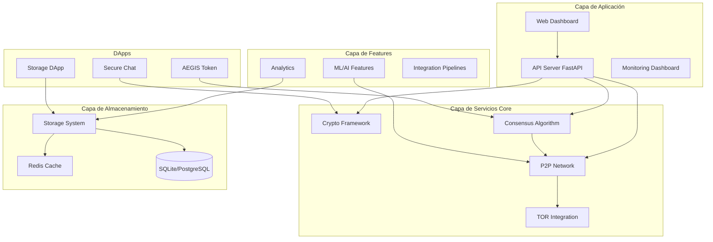
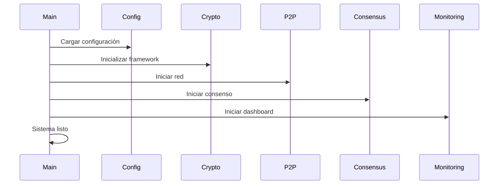
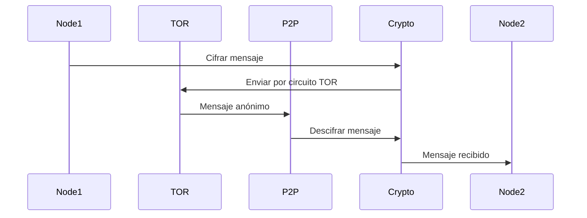

# Análisis Profundo del Proyecto AEGIS Open AGI

**Fecha de Análisis:** 21-01-2026 
**Versión del Proyecto:** 2.1.0  
**Analista:** Sistema de Análisis Automatizado

---

## Tabla de Contenidos

1. [Resumen Ejecutivo](#resumen-ejecutivo)
2. [Arquitectura General](#arquitectura-general)
3. [Componentes Core](#componentes-core)
4. [DApps (Aplicaciones Descentralizadas)](#dapps)
5. [Features Avanzadas](#features-avanzadas)
6. [Módulos OpenAGI](#módulos-openagi)
7. [Infraestructura y Despliegue](#infraestructura-y-despliegue)
8. [Seguridad](#seguridad)
9. [Estado del Proyecto](#estado-del-proyecto)
10. [Tecnologías Utilizadas](#tecnologías-utilizadas)
11. [Métricas del Proyecto](#métricas-del-proyecto)
12. [Fortalezas y Debilidades](#fortalezas-y-debilidades)
13. [Recomendaciones](#recomendaciones)
14. [Conclusiones](#conclusiones)

---

## Resumen Ejecutivo

**AEGIS Open AGI** es un framework de inteligencia artificial distribuida y colaborativa que implementa una arquitectura P2P (peer-to-peer) con integración TOR para comunicaciones anónimas. El proyecto combina tecnologías de blockchain, aprendizaje distribuido, consenso bizantino y criptografía avanzada para crear un ecosistema descentralizado de IA.

### Características Principales

- **Arquitectura Distribuida**: Sistema P2P sin puntos únicos de fallo
- **Seguridad Avanzada**: Cifrado end-to-end, autenticación multi-factor, detección de intrusiones
- **Anonimato**: Integración completa con red TOR
- **Consenso Bizantino**: Algoritmo PBFT + Proof of Computation
- **Aprendizaje Distribuido**: Coordinación de modelos ML en red descentralizada
- **DApps**: Aplicaciones descentralizadas (token, chat seguro, almacenamiento)
- **Quantum Currency**: Sistema de moneda cuántica con validación RΦV

### Estadísticas Clave

- **198 archivos Python** en el proyecto
- **49 módulos de features** avanzadas
- **3 DApps** principales (token, chat, storage)
- **32 documentos** de documentación
- **25+ archivos de tests**
- **Versión actual**: 2.1.0

---

## Arquitectura General

### Visión de Alto Nivel

El sistema AEGIS implementa una arquitectura de microservicios distribuidos con los siguientes principios:

1. **Modularidad**: Componentes independientes y desacoplados
2. **Descentralización**: Sin puntos únicos de fallo
3. **Seguridad por Diseño**: Controles de seguridad en todos los niveles
4. **Tolerancia a Fallos**: Operación continua con fallos parciales
5. **Observabilidad**: Monitoreo y métricas integradas

### Diagrama de Arquitectura



### Flujos de Datos Principales

#### 1. Inicialización del Sistema



#### 2. Procesamiento de Mensajes P2P



### Patrones de Diseño Implementados

1. **Observer**: Sistema de eventos para notificaciones entre componentes
2. **Strategy**: Algoritmos de consenso intercambiables (PBFT, Raft)
3. **Factory**: Creación de componentes criptográficos
4. **Singleton**: Gestores de configuración y recursos
5. **Repository**: Abstracción de acceso a datos

---

## Componentes Core

### 1. Crypto Framework (`crypto_framework.py`)

**Responsabilidades:**
- Gestión de identidades criptográficas (Ed25519)
- Cifrado simétrico (ChaCha20-Poly1305)
- Intercambio de claves (X25519)
- Double Ratchet para forward secrecy
- Firmas digitales para integridad

**Características Clave:**
- **SecurityLevel**: STANDARD, HIGH, PARANOID
- Rotación automática de claves
- Gestión de sesiones seguras
- Validación de mensajes

**Clases Principales:**
- `CryptoEngine`: Motor principal de criptografía
- `NodeIdentity`: Identidad criptográfica de nodos
- `RatchetState`: Estado del Double Ratchet
- `SecureMessage`: Mensajes cifrados

### 2. P2P Network (`p2p_network.py`)

**Responsabilidades:**
- Descubrimiento automático de peers (mDNS/Zeroconf)
- Gestión de topología de red
- Enrutamiento de mensajes
- Gestión de reputación de peers
- Recuperación de conexiones

**Características Clave:**
- **NodeType**: BOOTSTRAP, FULL, LIGHT, VALIDATOR, STORAGE
- Sistema de reputación anti-Sybil
- Detección de ataques Eclipse
- Balanceado de carga distribuido

**Clases Principales:**
- `PeerReputationManager`: Gestión de reputación
- `PeerDiscoveryService`: Descubrimiento de peers
- `ConnectionManager`: Gestión de conexiones
- `NetworkTopologyManager`: Topología de red

### 3. Consensus Algorithm (`consensus_algorithm.py`)

**Responsabilidades:**
- Consenso PBFT (Practical Byzantine Fault Tolerance)
- Votación ponderada por reputación
- Detección de comportamiento bizantino
- Sincronización de estado

**Características Clave:**
- Tolerancia a hasta (n-1)/3 nodos bizantinos
- Fases: PREPARE, PROMISE, PROPOSE, ACCEPT, COMMIT
- Cambio de vista automático
- Validación criptográfica de votos

**Clases Principales:**
- `ConsensusEngine`: Motor de consenso
- `ByzantineDetector`: Detección de nodos maliciosos
- `Proposal`: Propuestas de consenso
- `NodeState`: Estado de nodos en consenso

### 4. TOR Integration (`tor_integration.py`)

**Responsabilidades:**
- Integración con red TOR
- Gestión de circuitos TOR
- Rotación de circuitos
- Diversidad geográfica

**Características Clave:**
- Circuitos con 3-5 saltos
- Rotación automática por seguridad
- Selección de nodos por país
- Gestión de circuitos por nivel de seguridad

**Clases Principales:**
- `TorGateway`: Gateway principal
- `TorCircuit`: Gestión de circuitos
- `TorNode`: Representación de nodos TOR

### 5. Security Protocols (`security_protocols.py`)

**Responsabilidades:**
- Autenticación multi-factor
- Detección de intrusiones (IDS)
- Gestión de políticas de seguridad
- Auditoría y forense

**Características Clave:**
- **SecurityLevel**: LOW, MEDIUM, HIGH, CRITICAL, MAXIMUM
- Detección de patrones de ataque
- Rate limiting
- Análisis de comportamiento

**Clases Principales:**
- `SecurityProtocolManager`: Gestor principal
- `IntrusionDetectionSystem`: Sistema IDS
- `AuthenticationManager`: Autenticación
- `CryptographicManager`: Gestión criptográfica

### 6. Fault Tolerance (`fault_tolerance.py`)

**Responsabilidades:**
- Heartbeat entre nodos
- Replicación de datos
- Recuperación de nodos
- Detección de fallos

**Clases Principales:**
- `HeartbeatManager`: Gestión de heartbeat
- `DataReplicationManager`: Replicación
- `NodeRecoveryManager`: Recuperación
- `FaultToleranceOrchestrator`: Orquestador principal

### 7. Distributed Learning (`distributed_learning.py`)

**Responsabilidades:**
- Coordinación de aprendizaje federado
- Agregación de modelos
- Detección de ataques (poisoning)
- Sincronización de parámetros

### 8. Resource Manager (`resource_manager.py`)

**Responsabilidades:**
- Gestión de recursos computacionales
- Balanceado de carga
- Asignación de tareas
- Monitoreo de recursos

---

## DApps

### 1. AEGIS Token (`dapps/aegis-token/`)

**Descripción:** Token ERC-20 con funcionalidades de faucet y donaciones.

**Contrato Principal:** `AegisToken.sol`

**Características:**
- Mint inicial de 1,000,000 tokens
- Faucet con cooldown de 1 hora
- Función de donación
- Compatible con OpenZeppelin

**Stack Tecnológico:**
- Solidity ^0.8.20
- Hardhat para desarrollo
- OpenZeppelin Contracts ^5.4.0

### 2. Secure Chat (`dapps/secure-chat/`)

**Descripción:** Sistema de mensajería segura con almacenamiento en IPFS.

**Contrato Principal:** `ChatRoom.sol`

**Características:**
- Creación de salas de chat
- Mensajes almacenados en IPFS
- Sistema de membresía
- Eventos on-chain

**Stack Tecnológico:**
- Solidity ^0.8.20
- React + Vite para UI
- Web3.js para integración blockchain
- IPFS para almacenamiento

### 3. AEGIS Storage (`dapps/aegis-storage/`)

**Descripción:** Sistema de almacenamiento distribuido con verificación Merkle.

**Contratos:**
- `StorageIdentity.sol`: Gestión de identidades
- `AegisStorageLedger.sol`: Ledger de almacenamiento
- `AegisAuditLog.sol`: Logs de auditoría

**Características:**
- Fragmentación de archivos
- Verificación Merkle
- Proof of Retrievability (PoR)
- Identidades criptográficas

**Stack Tecnológico:**
- Python para servicio de almacenamiento
- Solidity para contratos
- API REST para acceso

---

## Features Avanzadas

El proyecto incluye **49 módulos** en `src/features/` que cubren:

### Machine Learning / AI
- `federated_learning.py`: Aprendizaje federado
- `distributed_training_massive.py`: Entrenamiento distribuido masivo
- `advanced_computer_vision.py`: Visión por computadora
- `natural_language_processing.py`: Procesamiento de lenguaje natural
- `generative_ai.py`: IA generativa
- `reinforcement_learning_integration.py`: Aprendizaje por refuerzo

### Analytics
- `advanced_analytics_forecasting.py`: Pronósticos avanzados
- `automatic_anomaly_detection.py`: Detección de anomalías
- `explainable_ai_shap.py`: IA explicable con SHAP

### Integración
- `multimodal_pipelines.py`: Pipelines multimodales
- `multimodal_fusion.py`: Fusión multimodal
- `quantum_integration.py`: Integración cuántica
- `integration_pipeline.py`: Pipeline de integración

### Infraestructura
- `edge_computing.py`: Edge computing
- `multi_cloud_orchestration.py`: Orquestación multi-cloud
- `tinyml_edge_ai.py`: TinyML para edge
- `model_serving_high_perf.py`: Servicio de modelos de alto rendimiento

### APIs y SDKs
- `aegis_api.py`: API principal
- `aegis_sdk.py`: SDK para desarrolladores
- `aegis_cli.py`: CLI avanzado
- `fastapi_auth.py`: Autenticación FastAPI

---

## Módulos OpenAGI

El directorio `openagi/` contiene el sistema de **Quantum Currency**:

### Componentes Principales

1. **Harmonic Validation** (`harmonic_validation.py`)
   - Validación RΦV (Recursive Φ-Resonance Validation)
   - Cálculo de coherence scores
   - Integración con CAL (Coherence Attunement Layer)

2. **Harmonic Wallet** (`harmonic_wallet.py`)
   - Billetera con seguridad cuántica
   - Gestión de múltiples tokens (FLX, CHR, PSY, ATR, RES)

3. **Validator Staking** (`validator_staking.py`)
   - Sistema de staking para validadores
   - Delegación de tokens
   - Recompensas por validación

4. **On-chain Governance** (`onchain_governance.py`)
   - Gobernanza descentralizada
   - Propuestas y votación
   - Ejecución automática

5. **Quantum RNG** (`quantum_rng.py`)
   - Generación de números aleatorios cuánticos
   - Entropía criptográfica

6. **Homomorphic Encryption** (`homomorphic_encryption.py`)
   - Cifrado homomórfico para privacidad
   - Cálculos sobre datos cifrados

---

## Infraestructura y Despliegue

### Docker Compose

El proyecto incluye múltiples configuraciones Docker:

1. **docker-compose.yml**: Configuración de desarrollo
2. **docker-compose.prod.yml**: Configuración de producción
3. **docker-compose.ci.yml**: Configuración para CI/CD

### Servicios Docker

- **TOR**: Servicio de anonimato
- **Redis**: Cache y sesiones
- **PostgreSQL/SQLite**: Base de datos
- **Nginx**: Reverse proxy y load balancer
- **Prometheus**: Métricas y monitoreo
- **Fluentd**: Agregación de logs

### Scripts de Despliegue

Ubicados en `scripts/deployment/`:
- `deploy_production.py`: Despliegue automatizado
- `deploy_vps.sh`: Despliegue en VPS
- `deploy_wsgi_production.py`: Despliegue WSGI
- Scripts de mantenimiento y actualización

### Configuración

- **app_config.json**: Configuración principal
- Variables de entorno para personalización
- Configuraciones por nivel (dev, test, prod)

---

## Seguridad

### Criptografía

**Algoritmos Utilizados:**
- **Ed25519**: Firmas digitales (256 bits)
- **X25519**: Intercambio de claves
- **ChaCha20-Poly1305**: Cifrado simétrico (256 bits)
- **BLAKE3**: Funciones hash
- **HKDF**: Derivación de claves

### Protecciones Implementadas

1. **Anti-Sybil**: Sistema de reputación y Proof of Work
2. **Anti-Eclipse**: Diversificación de conexiones
3. **Detección de Intrusiones**: IDS en tiempo real
4. **Rate Limiting**: Prevención de ataques DDoS
5. **Validación de Input**: Sanitización de datos

### Anonimato

- Integración completa con TOR
- Circuitos con múltiples saltos
- Rotación automática de circuitos
- Diversidad geográfica

### Auditoría

- Logs criptográficamente firmados
- Eventos auditables
- Trazabilidad completa
- Reportes de seguridad

---

## Estado del Proyecto

### Versión Actual: 2.1.0

**Cambios Recientes (CHANGELOG.md):**
- Rebranding a "AEGIS Open AGI"
- Reorganización en estructura `src/aegis_core`
- Soporte Node.js en CI/CD
- Actualización de dependencias
- Mejoras de seguridad

### Roadmap

Según `ROADMAP.md`:

**v0.2.0 (En Desarrollo):**
- Integración Ω-State
- CAL-RΦV Fusion
- AI Co-governance
- Mainnet deployment

**v0.3.0 (Planificado Q3 2026):**
- Enterprise features
- DeFi integration
- NFT marketplace
- Advanced analytics

**v1.0.0 (Planificado Q1 2027):**
- Production readiness
- Global compliance
- Enterprise support

### Testing

**Infraestructura:**
- **25+ archivos de tests** en `tests/`
- **pytest** como framework principal
- **Coverage** reporting
- **CI/CD** con GitHub Actions
- Tests unitarios, de integración y E2E

**Cobertura:**
- Tests de consenso
- Tests de seguridad
- Tests de integración
- Tests de rendimiento
- Tests de carga

---

## Tecnologías Utilizadas

### Backend
- **Python 3.9+**: Lenguaje principal
- **FastAPI**: API REST moderna
- **Flask**: Dashboard web
- **asyncio**: Programación asíncrona
- **aiohttp**: Cliente HTTP asíncrono
- **websockets**: Comunicación WebSocket

### Frontend
- **React**: Framework UI
- **Vite**: Build tool
- **JavaScript/TypeScript**: Lenguaje

### Blockchain
- **Solidity ^0.8.20**: Contratos inteligentes
- **Hardhat**: Framework de desarrollo
- **Web3.js**: Interacción con blockchain
- **OpenZeppelin**: Contratos seguros

### Machine Learning
- **PyTorch**: Framework ML
- **Transformers**: Modelos pre-entrenados
- **scikit-learn**: ML clásico
- **NumPy/SciPy**: Computación científica

### Infraestructura
- **Docker**: Contenedores
- **Redis**: Cache
- **SQLite/PostgreSQL**: Bases de datos
- **Prometheus**: Métricas
- **Nginx**: Reverse proxy

### Criptografía
- **cryptography**: Biblioteca Python
- **pycryptodome**: Criptografía adicional
- **stem**: Control TOR

---

## Métricas del Proyecto

### Código
- **198 archivos Python**
- **49 módulos de features**
- **3 DApps principales**
- **25+ archivos de tests**
- **32 documentos** de documentación

### Estructura
```
src/
├── aegis_core/        # 25 módulos core
├── features/          # 49 módulos de features
├── aegis_storage_*/   # Módulos de almacenamiento
└── legacy/           # Código legacy

dapps/
├── aegis-token/      # Token ERC-20
├── secure-chat/      # Chat seguro
└── aegis-storage/    # Almacenamiento

openagi/              # 20 módulos Quantum Currency
```

### Dependencias
- **Python**: 40+ dependencias principales
- **Node.js**: 20+ dependencias por DApp
- **Docker**: 8+ servicios configurados

---

## Fortalezas y Debilidades

### Fortalezas

1. **Arquitectura Robusta**
   - Diseño modular y desacoplado
   - Sin puntos únicos de fallo
   - Escalabilidad horizontal

2. **Seguridad Avanzada**
   - Múltiples capas de seguridad
   - Criptografía moderna
   - Detección de intrusiones

3. **Documentación Extensa**
   - 32 documentos MD
   - Guías de arquitectura
   - Documentación de seguridad
   - Roadmap detallado

4. **Testing Completo**
   - Suite de tests extensa
   - CI/CD integrado
   - Coverage reporting

5. **Tecnologías Modernas**
   - Stack actualizado
   - Mejores prácticas
   - Estándares de la industria

### Debilidades

1. **Complejidad**
   - Muchos componentes interdependientes
   - Curva de aprendizaje pronunciada
   - Requiere conocimiento especializado

2. **Dependencias**
   - Muchas dependencias externas
   - Posibles vulnerabilidades
   - Mantenimiento requerido

3. **Testing Coverage**
   - Cobertura no documentada completamente
   - Algunos módulos pueden necesitar más tests
   - Tests de integración complejos

4. **Documentación**
   - Algunas áreas podrían tener más detalle
   - Ejemplos de uso limitados
   - Guías de troubleshooting

5. **Performance**
   - Overhead de seguridad puede afectar rendimiento
   - TOR añade latencia
   - Consenso puede ser lento con muchos nodos

---

## Recomendaciones

### Corto Plazo (1-3 meses)

1. **Mejorar Testing Coverage**
   - Aumentar cobertura de tests unitarios
   - Agregar tests de integración para DApps
   - Implementar tests de carga regulares

2. **Documentación**
   - Crear guías de inicio rápido
   - Agregar más ejemplos de uso
   - Documentar troubleshooting común

3. **Optimización de Performance**
   - Profiling de componentes críticos
   - Optimización de consenso
   - Cache más agresivo

### Medio Plazo (3-6 meses)

1. **Simplificación**
   - Refactorizar componentes complejos
   - Reducir dependencias donde sea posible
   - Crear abstracciones más simples

2. **Monitoreo**
   - Dashboard de métricas mejorado
   - Alertas proactivas
   - Análisis de performance

3. **Seguridad**
   - Auditorías de seguridad regulares
   - Actualización de dependencias
   - Penetration testing

### Largo Plazo (6-12 meses)

1. **Escalabilidad**
   - Optimización para redes grandes
   - Sharding de datos
   - Mejoras de consenso

2. **Ecosistema**
   - SDK más completo
   - Herramientas de desarrollo
   - Comunidad y documentación

3. **Innovación**
   - Integración de nuevas tecnologías
   - Mejoras de IA distribuida
   - Optimizaciones cuánticas

---

## Conclusiones

**AEGIS Open AGI** es un proyecto ambicioso y bien estructurado que combina tecnologías avanzadas de IA distribuida, blockchain, criptografía y redes P2P. El proyecto demuestra:

✅ **Fortalezas Técnicas:**
- Arquitectura sólida y modular
- Seguridad robusta
- Tecnologías modernas
- Testing completo

⚠️ **Áreas de Mejora:**
- Reducir complejidad
- Mejorar documentación de uso
- Optimizar performance
- Aumentar cobertura de tests

🎯 **Potencial:**
El proyecto tiene un gran potencial para convertirse en una plataforma líder de IA distribuida, especialmente con las mejoras planificadas en el roadmap.

**Recomendación Final:** Continuar el desarrollo siguiendo el roadmap, priorizando la simplificación y documentación para facilitar la adopción por parte de la comunidad.

---

*Análisis generado automáticamente - Para más información, consultar la documentación en `docs/`*
