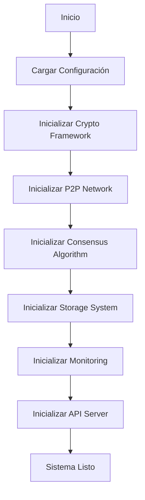
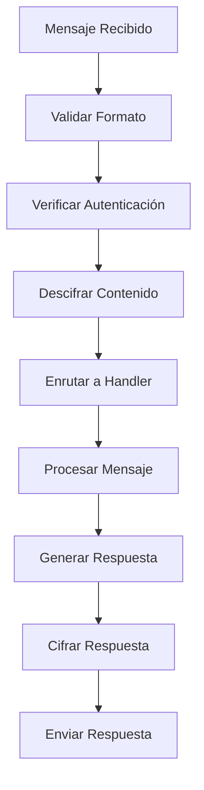
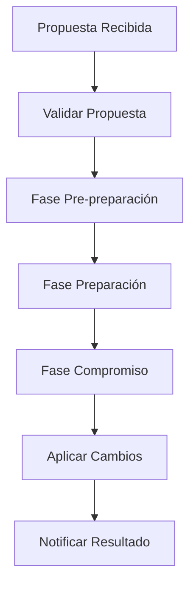

# AEGIS - Guía de Arquitectura Interna

## Índice
- [Visión General de la Arquitectura](#visión-general-de-la-arquitectura)
- [Patrones de Diseño](#patrones-de-diseño)
- [Módulos del Sistema](#módulos-del-sistema)
- [Flujos de Datos](#flujos-de-datos)
- [Protocolos de Comunicación](#protocolos-de-comunicación)
- [Gestión de Estado](#gestión-de-estado)
- [Seguridad y Criptografía](#seguridad-y-criptografía)
- [Escalabilidad y Rendimiento](#escalabilidad-y-rendimiento)
- [Tolerancia a Fallos](#tolerancia-a-fallos)
- [Extensibilidad](#extensibilidad)

## Visión General de la Arquitectura

AEGIS implementa una arquitectura distribuida modular basada en microservicios, diseñada para proporcionar alta disponibilidad, escalabilidad y seguridad en entornos descentralizados.

### Principios Arquitectónicos

1. **Modularidad**: Cada componente es independiente y puede ser desarrollado, desplegado y escalado por separado
2. **Descentralización**: No existe un punto único de fallo
3. **Seguridad por Diseño**: Todos los componentes implementan seguridad desde el nivel más bajo
4. **Tolerancia a Fallos**: El sistema continúa operando incluso con fallos parciales
5. **Observabilidad**: Monitoreo y métricas integradas en todos los niveles

### Arquitectura de Alto Nivel

```
┌─────────────────────────────────────────────────────────────┐
│                    AEGIS System                             │
├─────────────────────────────────────────────────────────────┤
│  ┌─────────────┐  ┌─────────────┐  ┌─────────────┐         │
│  │ Web Dashboard│  │ API Server  │  │ Monitoring  │         │
│  │   (Flask)   │  │  (FastAPI)  │  │ Dashboard   │         │
│  └─────────────┘  └─────────────┘  └─────────────┘         │
├─────────────────────────────────────────────────────────────┤
│  ┌─────────────┐  ┌─────────────┐  ┌─────────────┐         │
│  │   Crypto    │  │    P2P      │  │  Consensus  │         │
│  │ Framework   │  │  Network    │  │ Algorithm   │         │
│  └─────────────┘  └─────────────┘  └─────────────┘         │
├─────────────────────────────────────────────────────────────┤
│  ┌─────────────┐  ┌─────────────┐  ┌─────────────┐         │
│  │  Storage    │  │   Metrics   │  │   Alert     │         │
│  │   System    │  │ Collector   │  │   System    │         │
│  └─────────────┘  └─────────────┘  └─────────────┘         │
├─────────────────────────────────────────────────────────────┤
│  ┌─────────────┐  ┌─────────────┐  ┌─────────────┐         │
│  │   Backup    │  │   Config    │  │  Resource   │         │
│  │   System    │  │  Manager    │  │  Manager    │         │
│  └─────────────┘  └─────────────┘  └─────────────┘         │
└─────────────────────────────────────────────────────────────┘
```

## Patrones de Diseño

### 1. Patrón Observer
Utilizado para notificaciones entre componentes.

```python
class EventBus:
    def __init__(self):
        self._observers = {}
    
    def subscribe(self, event_type, callback):
        if event_type not in self._observers:
            self._observers[event_type] = []
        self._observers[event_type].append(callback)
    
    def publish(self, event_type, data):
        if event_type in self._observers:
            for callback in self._observers[event_type]:
                callback(data)
```

### 2. Patrón Strategy
Para algoritmos de consenso intercambiables.

```python
class ConsensusStrategy:
    def execute_consensus(self, proposal):
        raise NotImplementedError

class PBFTStrategy(ConsensusStrategy):
    def execute_consensus(self, proposal):
        # Implementación PBFT
        pass

class RaftStrategy(ConsensusStrategy):
    def execute_consensus(self, proposal):
        # Implementación Raft
        pass
```

### 3. Patrón Factory
Para creación de componentes criptográficos.

```python
class CryptoFactory:
    @staticmethod
    def create_cipher(algorithm):
        if algorithm == "AES":
            return AESCipher()
        elif algorithm == "ChaCha20":
            return ChaCha20Cipher()
        else:
            raise ValueError(f"Unsupported algorithm: {algorithm}")
```

### 4. Patrón Singleton
Para gestores de configuración y recursos.

```python
class ConfigManager:
    _instance = None
    _lock = threading.Lock()
    
    def __new__(cls):
        if cls._instance is None:
            with cls._lock:
                if cls._instance is None:
                    cls._instance = super().__new__(cls)
        return cls._instance
```

## Módulos del Sistema

### 1. Framework Criptográfico (crypto_framework.py)

#### Arquitectura Interna
```
CryptoFramework
├── KeyManager
│   ├── RSAKeyGenerator
│   ├── ECCKeyGenerator
│   └── Ed25519KeyGenerator
├── CipherManager
│   ├── AESCipher
│   ├── ChaCha20Cipher
│   └── RSACipher
├── HashManager
│   ├── SHA256Hash
│   ├── SHA3Hash
│   └── BLAKE2bHash
└── SignatureManager
    ├── RSASignature
    ├── ECDSASignature
    └── Ed25519Signature
```

#### Flujo de Operaciones Criptográficas
1. **Inicialización**: Carga de algoritmos y configuración
2. **Generación de Claves**: Creación segura de material criptográfico
3. **Operaciones**: Cifrado, descifrado, firma, verificación
4. **Gestión de Claves**: Almacenamiento seguro y rotación

#### Implementación de Seguridad
- Generación de números aleatorios criptográficamente seguros
- Protección contra ataques de canal lateral
- Validación de parámetros criptográficos
- Limpieza segura de memoria

### 2. Red P2P (p2p_network.py)

#### Arquitectura de Red
```
P2PNetwork
├── ConnectionManager
│   ├── TCPConnection
│   ├── UDPConnection
│   └── TorConnection
├── PeerDiscovery
│   ├── MDNSDiscovery
│   ├── DHTDiscovery
│   └── BootstrapDiscovery
├── MessageRouter
│   ├── DirectMessage
│   ├── BroadcastMessage
│   └── MulticastMessage
└── ProtocolHandler
    ├── HandshakeProtocol
    ├── HeartbeatProtocol
    └── DataProtocol
```

#### Protocolo de Comunicación
1. **Descubrimiento**: Localización de peers en la red
2. **Handshake**: Establecimiento de conexión segura
3. **Autenticación**: Verificación de identidad
4. **Intercambio de Datos**: Comunicación bidireccional
5. **Mantenimiento**: Heartbeat y reconexión

#### Gestión de Conexiones
- Pool de conexiones reutilizables
- Balanceador de carga para distribución de mensajes
- Detección y recuperación de fallos de red
- Rate limiting y control de flujo

### 3. Algoritmo de Consenso (consensus_algorithm.py)

#### Arquitectura de Consenso
```
ConsensusAlgorithm
├── ProposalManager
│   ├── ProposalValidator
│   ├── ProposalQueue
│   └── ProposalHistory
├── VotingManager
│   ├── VoteCollector
│   ├── VoteValidator
│   └── VoteAggregator
├── StateManager
│   ├── ViewManager
│   ├── RoundManager
│   └── LeaderElection
└── MessageHandler
    ├── PrepareHandler
    ├── CommitHandler
    └── ViewChangeHandler
```

#### Fases del Consenso PBFT
1. **Pre-preparación**: El líder propone un valor
2. **Preparación**: Los nodos validan la propuesta
3. **Compromiso**: Los nodos se comprometen con el valor
4. **Finalización**: El consenso se alcanza y se aplica

#### Tolerancia a Fallos Bizantinos
- Detección de nodos maliciosos
- Recuperación automática de particiones de red
- Cambio de vista en caso de líder defectuoso
- Validación criptográfica de todos los mensajes

### 4. Sistema de Almacenamiento

#### Arquitectura de Almacenamiento
```
StorageSystem
├── LocalStorage
│   ├── FileSystemStorage
│   ├── DatabaseStorage
│   └── CacheStorage
├── DistributedStorage
│   ├── ReplicationManager
│   ├── ShardingManager
│   └── ConsistencyManager
├── DataManager
│   ├── Serializer
│   ├── Compressor
│   └── Encryptor
└── IndexManager
    ├── BTreeIndex
    ├── HashIndex
    └── BloomFilter
```

#### Estrategias de Replicación
- **Replicación Síncrona**: Para datos críticos
- **Replicación Asíncrona**: Para datos menos críticos
- **Replicación Adaptativa**: Basada en patrones de acceso

### 5. Sistema de Monitoreo

#### Arquitectura de Monitoreo
```
MonitoringSystem
├── MetricsCollector
│   ├── SystemMetrics
│   ├── ApplicationMetrics
│   └── CustomMetrics
├── AlertManager
│   ├── RuleEngine
│   ├── NotificationManager
│   └── EscalationManager
├── Dashboard
│   ├── RealTimeDashboard
│   ├── HistoricalDashboard
│   └── CustomDashboard
└── LogManager
    ├── LogCollector
    ├── LogProcessor
    └── LogAnalyzer
```

## Flujos de Datos

### 1. Flujo de Inicialización del Sistema



### 2. Flujo de Procesamiento de Mensajes P2P



### 3. Flujo de Consenso



## Protocolos de Comunicación

### 1. Protocolo de Handshake P2P

```
Cliente                    Servidor
   |                          |
   |--- HELLO (version) ----->|
   |                          |
   |<-- HELLO_ACK (version) --|
   |                          |
   |--- AUTH (credentials) -->|
   |                          |
   |<-- AUTH_ACK (token) -----|
   |                          |
   |--- READY --------------->|
   |                          |
   |<-- READY_ACK ------------|
```

### 2. Protocolo de Consenso PBFT

```
Líder                 Seguidores
  |                      |
  |-- PRE-PREPARE ------>|
  |                      |
  |<-- PREPARE ----------|
  |                      |
  |-- COMMIT ----------->|
  |                      |
  |<-- COMMIT_ACK -------|
```

### 3. Protocolo de Sincronización de Datos

```
Nodo A                 Nodo B
  |                      |
  |-- SYNC_REQUEST ----->|
  |                      |
  |<-- SYNC_RESPONSE ----|
  |                      |
  |-- DATA_CHUNK ------->|
  |                      |
  |<-- ACK --------------|
```

## Gestión de Estado

### 1. Estado del Sistema
El estado global del sistema se mantiene de forma distribuida:

```python
class SystemState:
    def __init__(self):
        self.crypto_state = CryptoState()
        self.p2p_state = P2PState()
        self.consensus_state = ConsensusState()
        self.storage_state = StorageState()
        self.monitoring_state = MonitoringState()
```

### 2. Sincronización de Estado
- **Consenso**: Para cambios críticos del sistema
- **Gossip Protocol**: Para información no crítica
- **Merkle Trees**: Para verificación de integridad

### 3. Persistencia de Estado
- **Snapshots**: Capturas periódicas del estado
- **Write-Ahead Logging**: Para recuperación de fallos
- **Checkpoints**: Puntos de recuperación conocidos

## Seguridad y Criptografía

### 1. Capas de Seguridad

```
┌─────────────────────────────────┐
│     Application Security        │ ← Autenticación, Autorización
├─────────────────────────────────┤
│     Transport Security          │ ← TLS, Cifrado de Mensajes
├─────────────────────────────────┤
│     Network Security            │ ← Tor, VPN, Firewall
├─────────────────────────────────┤
│     Data Security               │ ← Cifrado en Reposo
└─────────────────────────────────┘
```

### 2. Gestión de Claves
- **Jerarquía de Claves**: Master key → Derived keys
- **Rotación Automática**: Cambio periódico de claves
- **Escrow de Claves**: Recuperación segura
- **Hardware Security Modules**: Para claves críticas

### 3. Protocolos Criptográficos
- **Perfect Forward Secrecy**: Cada sesión usa claves únicas
- **Zero-Knowledge Proofs**: Verificación sin revelación
- **Homomorphic Encryption**: Computación sobre datos cifrados

## Escalabilidad y Rendimiento

### 1. Estrategias de Escalabilidad

#### Escalabilidad Horizontal
- **Sharding**: Particionado de datos
- **Load Balancing**: Distribución de carga
- **Microservicios**: Escalado independiente

#### Escalabilidad Vertical
- **Optimización de Algoritmos**: Mejores complejidades
- **Caching**: Reducción de latencia
- **Paralelización**: Uso de múltiples cores

### 2. Optimizaciones de Rendimiento

#### Nivel de Red
- **Connection Pooling**: Reutilización de conexiones
- **Message Batching**: Agrupación de mensajes
- **Compression**: Reducción de ancho de banda

#### Nivel de Datos
- **Indexing**: Acceso rápido a datos
- **Caching**: Datos frecuentemente accedidos
- **Lazy Loading**: Carga bajo demanda

#### Nivel de Aplicación
- **Async/Await**: Programación asíncrona
- **Thread Pools**: Gestión eficiente de hilos
- **Memory Pools**: Gestión de memoria

### 3. Métricas de Rendimiento

```python
class PerformanceMetrics:
    def __init__(self):
        self.throughput = ThroughputMetric()
        self.latency = LatencyMetric()
        self.resource_usage = ResourceUsageMetric()
        self.error_rate = ErrorRateMetric()
```

## Tolerancia a Fallos

### 1. Tipos de Fallos

#### Fallos de Hardware
- **Disk Failures**: Redundancia RAID
- **Network Failures**: Múltiples rutas
- **Server Failures**: Replicación

#### Fallos de Software
- **Application Crashes**: Restart automático
- **Memory Leaks**: Monitoreo y limpieza
- **Deadlocks**: Detección y resolución

#### Fallos Bizantinos
- **Nodos Maliciosos**: Detección y aislamiento
- **Mensajes Corruptos**: Verificación criptográfica
- **Ataques de Timing**: Protecciones temporales

### 2. Mecanismos de Recuperación

#### Circuit Breaker Pattern
```python
class CircuitBreaker:
    def __init__(self, failure_threshold=5, timeout=60):
        self.failure_threshold = failure_threshold
        self.timeout = timeout
        self.failure_count = 0
        self.last_failure_time = None
        self.state = "CLOSED"  # CLOSED, OPEN, HALF_OPEN
```

#### Retry with Exponential Backoff
```python
async def retry_with_backoff(func, max_retries=3, base_delay=1):
    for attempt in range(max_retries):
        try:
            return await func()
        except Exception as e:
            if attempt == max_retries - 1:
                raise e
            delay = base_delay * (2 ** attempt)
            await asyncio.sleep(delay)
```

### 3. Estrategias de Backup y Recuperación

#### Backup Strategies
- **Full Backup**: Copia completa periódica
- **Incremental Backup**: Solo cambios desde último backup
- **Differential Backup**: Cambios desde último full backup

#### Recovery Strategies
- **Point-in-Time Recovery**: Restauración a momento específico
- **Hot Standby**: Réplica activa lista para uso
- **Cold Standby**: Réplica inactiva que requiere activación

## Extensibilidad

### 1. Plugin Architecture

```python
class PluginManager:
    def __init__(self):
        self.plugins = {}
        self.hooks = {}
    
    def register_plugin(self, name, plugin):
        self.plugins[name] = plugin
        plugin.initialize()
    
    def execute_hook(self, hook_name, *args, **kwargs):
        if hook_name in self.hooks:
            for callback in self.hooks[hook_name]:
                callback(*args, **kwargs)
```

### 2. API Extensions

#### Custom Endpoints
```python
@api_router.post("/custom/endpoint")
async def custom_endpoint(request: CustomRequest):
    # Implementación personalizada
    return {"result": "custom_response"}
```

#### Custom Middleware
```python
class CustomMiddleware:
    def __init__(self, app):
        self.app = app
    
    async def __call__(self, scope, receive, send):
        # Lógica personalizada
        await self.app(scope, receive, send)
```

### 3. Configuration Extensions

```python
class ExtensibleConfig:
    def __init__(self):
        self.base_config = load_base_config()
        self.extensions = {}
    
    def add_extension(self, name, config):
        self.extensions[name] = config
    
    def get_config(self, path):
        return self._resolve_path(path)
```

## Patrones de Integración

### 1. Event-Driven Architecture

```python
class EventDrivenSystem:
    def __init__(self):
        self.event_bus = EventBus()
        self.event_handlers = {}
    
    def publish_event(self, event_type, data):
        self.event_bus.publish(event_type, data)
    
    def subscribe_to_event(self, event_type, handler):
        self.event_bus.subscribe(event_type, handler)
```

### 2. Message Queue Integration

```python
class MessageQueueIntegration:
    def __init__(self, queue_type="redis"):
        self.queue = self._create_queue(queue_type)
    
    async def publish_message(self, topic, message):
        await self.queue.publish(topic, message)
    
    async def consume_messages(self, topic, handler):
        async for message in self.queue.consume(topic):
            await handler(message)
```

### 3. Database Integration

```python
class DatabaseIntegration:
    def __init__(self, db_type="postgresql"):
        self.db = self._create_connection(db_type)
        self.migrations = MigrationManager(self.db)
    
    async def execute_query(self, query, params=None):
        return await self.db.execute(query, params)
```

## Consideraciones de Despliegue

### 1. Containerización

```dockerfile
FROM python:3.11-slim

WORKDIR /app
COPY requirements.txt .
RUN pip install -r requirements.txt

COPY . .
EXPOSE 8080

CMD ["python", "main.py"]
```

### 2. Orquestación con Kubernetes

```yaml
apiVersion: apps/v1
kind: Deployment
metadata:
  name: aegis-deployment
spec:
  replicas: 3
  selector:
    matchLabels:
      app: aegis
  template:
    metadata:
      labels:
        app: aegis
    spec:
      containers:
      - name: aegis
        image: aegis:latest
        ports:
        - containerPort: 8080
```

### 3. Service Mesh Integration

```yaml
apiVersion: networking.istio.io/v1alpha3
kind: VirtualService
metadata:
  name: aegis-vs
spec:
  hosts:
  - aegis
  http:
  - route:
    - destination:
        host: aegis
        port:
          number: 8080
```

## Mejores Prácticas

### 1. Desarrollo
- **Test-Driven Development**: Tests antes que código
- **Code Reviews**: Revisión por pares obligatoria
- **Continuous Integration**: Integración automática
- **Documentation**: Documentación actualizada

### 2. Seguridad
- **Principle of Least Privilege**: Mínimos permisos necesarios
- **Defense in Depth**: Múltiples capas de seguridad
- **Regular Audits**: Auditorías de seguridad periódicas
- **Incident Response**: Plan de respuesta a incidentes

### 3. Operaciones
- **Monitoring**: Monitoreo proactivo
- **Alerting**: Alertas inteligentes
- **Capacity Planning**: Planificación de capacidad
- **Disaster Recovery**: Plan de recuperación de desastres

---

*Esta guía de arquitectura proporciona una visión completa del diseño interno de AEGIS. Para implementaciones específicas, consulte la documentación de cada módulo individual.*